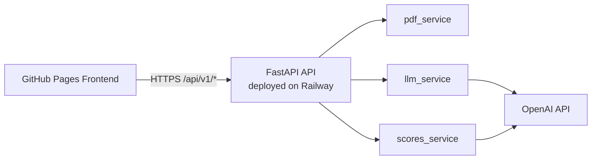
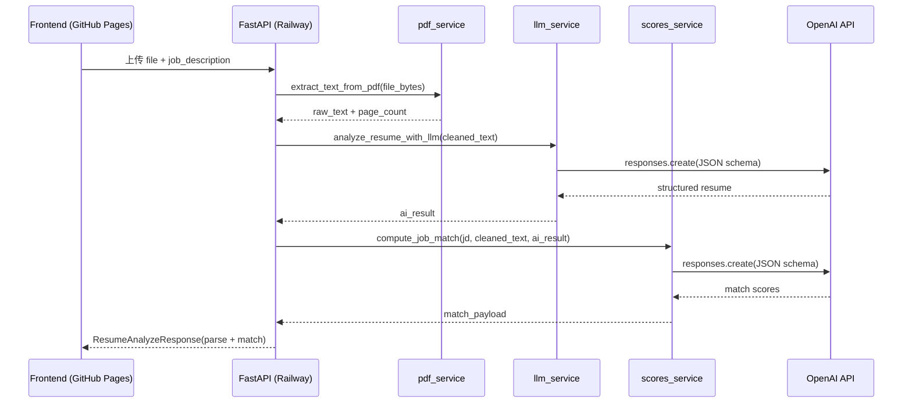

# Sidereus AI · 智能简历分析系统（Resume Lab）

基于 **FastAPI + OpenAI** 的简历分析服务。上传 PDF 简历并输入岗位 JD，返回结构化解析结果与匹配评分。

- 后端：Railway（API）
- 前端：GitHub Pages（静态页面）
- 形态：前后端分离（不同源）

**仓库地址：** [https://github.com/Cfengsu2002/Sidereus-AI](https://github.com/Cfengsu2002/Sidereus-AI)  
**后端 API：** [https://sidereus-ai-production.up.railway.app](https://sidereus-ai-production.up.railway.app)  
**API 文档：** [https://sidereus-ai-production.up.railway.app/docs](https://sidereus-ai-production.up.railway.app/docs)  
**健康检查：** [https://sidereus-ai-production.up.railway.app/api/v1/health](https://sidereus-ai-production.up.railway.app/api/v1/health)  
**前端页面（GitHub Pages）：** `https://cfengsu2002.github.io/Sidereus-AI/`（启用后可访问）

---

## 项目架构

当前项目采用 **前后端分离（不同源）**：

- 前端：GitHub Pages 托管静态页面（`index.html` + `script.js` + `styles.css`）
- 后端：Railway 托管 FastAPI（仅 API，不托管静态资源）
- AI：后端通过 OpenAI SDK 调用大模型完成抽取与评分

### 1) 部署拓扑



### 2) 后端分层设计

- **Controller 层**（`backend/controllers/resume_controller.py`）
  - 负责路由定义、参数校验、异常映射（400/502）、响应拼装
  - 对外暴露 `/health`、`/resume/parse`、`/resume/match`、`/resume/analyze`
- **Service 层**
  - `pdf_service`：从上传的 PDF（二进制）提取多页文本与页数
  - `llm_service`：清洗文本、分段并抽取结构化关键信息（JSON Schema）
  - `scores_service`：对 JD 与简历做关键词与匹配评分（JSON Schema）
- **Schema 层**（`backend/schemas/`）
  - 用 Pydantic 统一响应结构，确保接口输出稳定

### 3) 核心时序（`POST /api/v1/resume/analyze`）



### 4) 关键设计说明

- `pdf_service` 是主链路必经步骤：LLM 输入来自 PDF 抽取后的文本。
- `scores_service` 使用 `llm_service` 的结构化结果作为 `resume_structured_hint`，提升匹配稳定性。
- CORS 允许跨域，保证 GitHub Pages 可以直接调用 Railway API。
- 缓存当前未实现（每次请求都会重新调用模型），与笔试说明中的加分项一致。

### 目录结构

```text
backend/
  main.py
  controllers/
  services/
  schemas/
frontend/
  index.html
  script.js
  styles.css
Dockerfile
docker-compose.yml
requirements.txt
```

---

## 技术选型

- **FastAPI + Uvicorn**：RESTful API、自动文档、类型友好
- **pypdf**：多页 PDF 文本抽取
- **OpenAI SDK**：简历结构化提取与 JD 匹配评分
- **Pydantic**：统一响应结构与字段约束
- **Docker + Railway**：后端容器化部署
- **GitHub Pages**：前端静态托管

---

## 功能实现（对照笔试）

### 模块一：简历上传与解析（必选）
- 支持单个 PDF 上传
- 支持多页文本抽取
- 对文本进行清洗与结构化处理

### 模块二：关键信息提取（必选）
- 必选字段：姓名、电话、邮箱、地址
- 加分字段：求职意向、期望薪资、工作年限、学历背景、项目经历

### 模块三：简历评分与匹配（必选）
- 接收 JD 文本
- 提取关键词与重叠项
- 输出技能匹配率、经验相关性、学历相关性、综合评分

### 模块四：结果返回与缓存（必选）
- JSON 结构化返回（已完成）
- Redis 缓存（未实现，加分项）

### 模块五：前端页面（必选）
- 已提供可交互前端页面
- 支持独立部署到 GitHub Pages

---

## 接口说明

基础前缀：`/api/v1`

- `GET /health`：健康检查
- `POST /resume/parse`：仅解析简历
- `POST /resume/match`：仅做匹配评分
- `POST /resume/analyze`：解析 + 匹配（推荐）

`/resume/analyze` 入参为 `multipart/form-data`：
- `file`：PDF 简历
- `job_description`：岗位 JD（不少于 20 字）

---

## 使用说明

### 1) 本地启动后端 API

```bash
python3 -m venv .venv
source .venv/bin/activate
pip install -r requirements.txt
cp .env.example .env
# 编辑 .env，填入 OPENAI_API_KEY
uvicorn backend.main:app --reload --host 127.0.0.1 --port 8000
```

启动后可访问：
- 本地 API：`http://127.0.0.1:8000`
- 本地 API 文档：`http://127.0.0.1:8000/docs`

### 2) 本地启动前端（分离模式）

```bash
cd frontend
python3 -m http.server 5500 --bind 127.0.0.1
```

访问：
- 前端：`http://127.0.0.1:5500`
- 后端 API：`http://127.0.0.1:8000`

### 3) 线上使用（推荐给评审）

- 前端（GitHub Pages）：`https://cfengsu2002.github.io/Sidereus-AI/`
- 后端（Railway API）：`https://sidereus-ai-production.up.railway.app`
- 健康检查：`https://sidereus-ai-production.up.railway.app/api/v1/health`

在页面中操作步骤：
1. 上传单个 PDF 简历
2. 输入岗位 JD（至少 20 字）
3. 点击“上传并分析”
4. 查看解析结果与匹配评分，必要时复制完整 JSON

### 4) API 调用示例（`/resume/analyze`）

```bash
curl -X POST "https://sidereus-ai-production.up.railway.app/api/v1/resume/analyze" \
  -F "file=@/path/to/resume.pdf" \
  -F "job_description=负责 Python 后端开发，熟悉 FastAPI、数据库与部署流程，有良好工程规范。"
```

返回结果包含两部分：
- `parse`：简历清洗、分段与关键信息抽取
- `match`：关键词分析与匹配评分（含 `overall_score`）

### 5) 验收检查（提交前）

- `GET /api/v1/health` 返回 `{"status":"ok"}`
- 页面可完成一次真实 PDF + JD 分析
- 无 `Missing OPENAI_API_KEY` 报错
- README 中仓库/API/页面地址都可访问

---

## 部署方式

## 后端部署（Railway）

1. 将仓库推送到 GitHub
2. Railway 新建项目，选择该仓库
3. 配置 Variables：
   - `OPENAI_API_KEY`（必填）
   - `OPENAI_BASE_URL`（可选）
   - `OPENAI_MODEL`（可选）
4. 生成公网域名并验证 `/api/v1/health`

## 前端部署（GitHub Pages）

本项目已改为**单一前端目录**：只保留 `frontend/`，由 GitHub Actions 直接发布到 Pages。

在 GitHub 仓库设置：
- `Settings -> Pages`
- Source 选择 `GitHub Actions`

然后推送代码到 `main`（或在 Actions 手动运行），工作流会自动发布 `frontend/`。

---

## 环境变量

- `OPENAI_API_KEY`：必填
- `OPENAI_BASE_URL`：可选
- `OPENAI_MODEL`：可选

注意：`.env` 仅用于本地开发，线上请在 Railway Variables 中配置。

---

## 常见问题

- **报错 `Missing OPENAI_API_KEY`**  
  Railway 未配置变量，补充后重新部署。

- **GitHub Pages 打开但无法分析**  
  检查后端 Railway 地址是否可访问，且浏览器请求未被拦截。

- **跨域问题**  
  后端已开启 CORS（`allow_origins=["*"]`），通常可直接联通。

---

## 提交检查清单

- [ ] GitHub 仓库公开可访问
- [ ] Railway API 可访问
- [ ] GitHub Pages 前端可访问
- [ ] 上传 PDF + 输入 JD 可完成一次完整分析
- [ ] README 中地址与说明为最新

---

## License

本项目为 Sidereus AI 招聘笔试作品。
