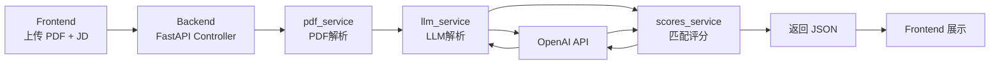

# **AI 赋能的智能简历分析系统**

基于 **FastAPI + OpenAI** 的简历分析服务。上传 PDF 简历并输入岗位 JD，返回结构化解析结果与匹配评分。

我这次原本想用阿里云部署，但在开通相关服务时，平台因为账号安全风控中止了下单，所以暂时无法继续使用阿里云。最终我改用了 Railway 部署后端，前端则部署在 GitHub Pages。- 后端：Railway
- 前端：GitHub Pages

**仓库地址：** https://github.com/Cfengsu2002/Sidereus-AI

**前端页面（GitHub Pages）：** https://cfengsu2002.github.io/Sidereus-AI/

## 项目架构

前端页面独立部署在 GitHub Pages，浏览器通过 HTTPS 调用 Railway API。后端内部按控制层 + 服务层拆分。



## 技术选型

- **FastAPI + Uvicorn**：RESTful API、自动文档、类型友好
- **pypdf**：多页 PDF 文本抽取
- **OpenAI SDK**：简历结构化提取与 JD 匹配评分
- **Pydantic**：统一响应结构与字段约束
- **Docker + Railway**：后端容器化部署
- **GitHub Pages**：前端托管

## 使用说明

### 本地

启动后端

```markdown
python3 -m venv .venv
source .venv/bin/activate
pip install -r requirements.txt
cp .env.example .env
uvicorn backend.main:app --reload --host 127.0.0.1 --port 8000
```

启动前端

```markdown
cd frontend
python3 -m http.server 5500 --bind 127.0.0.1
```

### 部署方式

后端部署（Railway）

1. 将仓库推送到 GitHub
2. Railway 新建项目，选择该仓库
3. 配置 Variables：
    - OPENAI_API_KEY
    - OPENAI_MODEL
4. 生成公网域名

前端部署

在 GitHub 仓库设置：

- Settings -> Pages
- Source 选择 GitHub Actions

然后推送代码到 main（或在 Actions 手动运行），工作流会自动发布 frontend。

### 使用说明

1. 打开前端页面：https://cfengsu2002.github.io/Sidereus-AI/
2. 在“简历 PDF”区域点击选择文件。
3. 在“岗位 JD”输入框粘贴岗位描述。
4. 点击“上传并分析”，等待系统处理。
5. 页面会展示：
简历解析结果（清洗文本、结构化关键信息）
匹配评分结果（关键词、匹配率、综合分）
完整 JSON（可点击“复制 JSON”）
