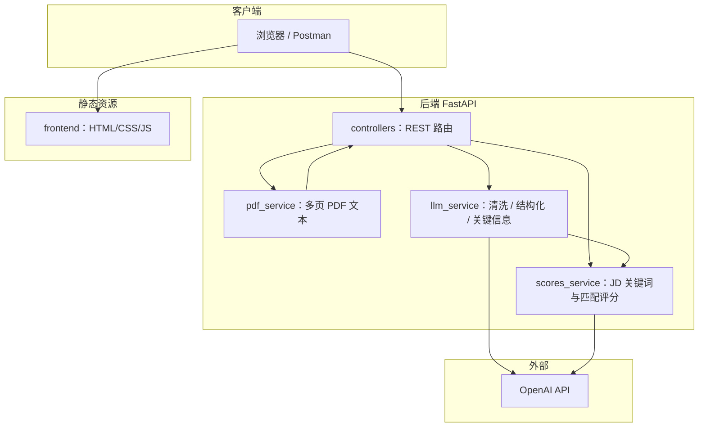

# Sidereus AI · 智能简历分析系统（Resume Lab）

基于 **FastAPI** 与 **OpenAI** 的简历解析与岗位匹配服务：上传 PDF 简历、粘贴岗位描述（JD），返回结构化解析结果与匹配评分。前端为静态 HTML/CSS/JS，采用**前后端分离（不同源）**：前端可独立托管，API 由 Railway 提供。

**仓库：** [github.com/Cfengsu2002/Sidereus-AI](https://github.com/Cfengsu2002/Sidereus-AI)  

**线上 API（Railway）：** [https://sidereus-ai-production.up.railway.app/](https://sidereus-ai-production.up.railway.app/) · 健康检查：`GET /api/v1/health` · API 文档：`/docs`

笔试题目建议的运行环境为 **阿里云 Serverless（函数计算 FC）**。作者在阿里云控制台开通 **函数计算** 时，订单被系统中止，提示「**为保护您的账户安全，下单被中止，详情请联系客服**」，在限定时间内未能完成 FC 账号侧开通与资源创建，无法在阿里侧落地部署。

因此在本次提交中选用 **Railway**：以同一 **Dockerfile** 交付 **容器化 Python 后端**，暴露 **HTTPS 公网地址**，满足笔试对 **RESTful API**、**可线上验收** 的要求；架构上仍可与 FC「自定义镜像」对齐，后续账号恢复后可再将镜像推送至阿里云 ACR、在 FC 部署。

本文档对应笔试要求，包含：**项目架构**、**技术选型**、**部署方式**、**使用说明**。

---

## 一、项目架构

### 总体结构

采用 **前后端分离部署**：前端静态资源独立托管，浏览器通过跨域请求访问 Railway API。核心业务按 **路由层 → 服务层** 拆分，PDF 与 LLM 调用隔离在独立 Service 中，便于测试与替换实现。



### 请求链路（以「一键分析」为例）

1. **上传**：`POST /api/v1/resume/analyze`，`multipart/form-data`：`file`（PDF）、`job_description`（文本）。
2. **PDF**：`pdf_service` 逐页抽取纯文本，得到 `page_count` 与正文。
3. **解析**：`llm_service` 对正文清洗、分段，并按 JSON Schema 抽取基本信息、求职信息、背景信息等。
4. **匹配**：`scores_service` 结合 JD 与简历正文（及结构化摘要），由 LLM 输出关键词、重叠项与各维度评分。
5. **响应**：返回 JSON（`ResumeAnalyzeResponse`：`parse` + `match`）。

### 目录与职责

| 路径 | 职责 |
|------|------|
| `backend/main.py` | 应用入口：CORS、`/api/v1` 路由挂载（仅 API） |
| `backend/controllers/` | RESTful 路由：`/health`、`/resume/parse`、`/resume/match`、`/resume/analyze` |
| `backend/services/pdf_service.py` | 多页 PDF 文本提取 |
| `backend/services/llm_service.py` | OpenAI：简历清洗、分段、关键字段抽取 |
| `backend/services/scores_service.py` | OpenAI：JD 关键词与匹配度评分 |
| `backend/schemas/` | Pydantic 模型，统一 JSON 响应结构 |
| `frontend/` | 交互页面，可独立托管（GitHub Pages/本地静态服务） |

---

## 二、技术选型

| 类别 | 选型 | 说明 |
|------|------|------|
| 语言与运行时 | **Python 3.11** | 与笔试要求一致，生态成熟 |
| Web 框架 | **FastAPI** | 原生异步、自动 OpenAPI（`/docs`）、类型提示与 Pydantic 校验，适合 RESTful API |
| ASGI 服务器 | **Uvicorn** | 生产级 ASGI，与 FastAPI 标配组合 |
| PDF | **pypdf** | 纯 Python，多页 `PdfReader` 抽取文本，满足笔试「多页简历」 |
| AI 调用 | **OpenAI 官方 SDK** | 使用 Responses API + **JSON Schema** 约束输出，降低解析失败与非结构化字段 |
| 模型配置 | **环境变量** `OPENAI_MODEL` | 默认可在代码中兜底；线上通过 Variables 覆盖，便于切换模型 |
| 前端 | **原生 HTML/CSS/JS** | 无构建链路，可独立托管，跨域调用 Railway API |
| 容器 | **Dockerfile** | 单一镜像包含后端与 `frontend`，监听 **`PORT`**，兼容 Railway 等平台注入 |
| 云平台 | **Railway** | 连接 GitHub 自动构建 Docker；**Variables** 注入密钥；**Generate Domain** 提供 HTTPS 演示地址 |

**未实现（笔试加分项）**：结果 **Redis 缓存**；当前每次请求完整调用 LLM，便于评审复现一致结果。

---

## 三、部署方式

### 3.0 与阿里云函数计算（FC）的关系

| 题目建议 | 本次交付 |
|---------|---------|
| 阿里云 FC 等 Serverless | **Railway**（容器托管 + 自动生成公网域名） |

**选用 Railway 的直接原因：** 作者在开通阿里云「函数计算」时出现**账户侧风控/安全策略拦截**（无法正常完成开通），并非实现方案排斥 FC。本项目 **Dockerfile** 仍可照阿里云文档推送到 **容器镜像服务 ACR** → **函数计算自定义容器**，与题目技术路径兼容；若评审需验证 FC，可在账号允许后沿用同一镜像部署。

### 3.1 推荐：Railway（Docker）

1. 将代码推送到 **GitHub**（建议 **Public**，便于笔试提交）。
2. 登录 [Railway](https://railway.app) → **New Project** → **Deploy from GitHub**，选择本仓库。
3. 选中 **Sidereus-AI** 服务 → **Variables**，至少添加：
   - **`OPENAI_API_KEY`**（必填）
   - 可选：`OPENAI_BASE_URL`、`OPENAI_MODEL`
4. **Settings → Networking → Generate Domain**，生成公网 HTTPS 域名（未生成则服务为 *Unexposed*，浏览器无法访问）。
5. 部署完成后访问：`https://<your-domain>/` 为前端，`GET https://<your-domain>/api/v1/health` 应返回 `{"status":"ok"}`。

构建说明：Railway 识别根目录 **Dockerfile**，容器内进程监听 **`PORT`**（平台自动注入）。

### 3.2 本地 Docker（可选）

```bash
docker build -t resume-api:latest .
docker run --rm -p 9000:9000 --env-file .env -e PORT=9000 resume-api:latest
```

或使用 `docker compose up --build`（参见仓库内 `docker-compose.yml`）。

### 3.3 其它云平台

任意支持 **Docker** 或 **Python + `uvicorn backend.main:app`** 的环境均可部署；镜像与启动命令与上文一致，需自行配置 HTTPS 与环境变量。

---

## 四、使用说明

### 4.1 本地开发

```bash
python3 -m venv .venv
source .venv/bin/activate          # Windows: .venv\Scripts\activate
pip install -r requirements.txt
cp .env.example .env               # 编辑 .env，填入 OPENAI_API_KEY

uvicorn backend.main:app --reload --host 127.0.0.1 --port 8000
```

| 用途 | 地址 |
|------|------|
| 线上 API（Railway） | https://sidereus-ai-production.up.railway.app/ |
| 本地后端 API | http://127.0.0.1:8000/ |
| 本地前端静态服务（分离） | http://127.0.0.1:5500/ |
| Swagger | `https://sidereus-ai-production.up.railway.app/docs`（或本地 `http://127.0.0.1:8000/docs`） |
| 健康检查 | `https://sidereus-ai-production.up.railway.app/api/v1/health` |

本地前后端分离调试可执行：

```bash
cd frontend && python3 -m http.server 5500 --bind 127.0.0.1
```

### 4.2 网页操作（前后端分离）

1. 打开前端页面（例如 `http://127.0.0.1:5500/` 或你的静态托管地址）。
2. 选择 **PDF 简历**（仅支持单个 PDF）。
3. 粘贴 **岗位描述**，不少于 **20** 字。
4. 点击分析，查看结构化结果与匹配评分；可复制 JSON。

### 4.3 REST API 摘要

前缀：**`/api/v1`**。

| 方法 | 路径 | 说明 |
|------|------|------|
| GET | `/health` | 存活探测 |
| POST | `/resume/parse` | `multipart`：`file`（PDF）— 解析与关键信息 |
| POST | `/resume/match` | `multipart`：`file`、`job_description` — 仅匹配评分 |
| POST | `/resume/analyze` | `multipart`：`file`、`job_description` — **推荐**，解析 + 匹配一次返回 |

完整参数与响应字段见 **`/docs`**（OpenAPI）。

### 4.4 环境变量说明

| 变量 | 必填 | 说明 |
|------|------|------|
| `OPENAI_API_KEY` | 线上必填 | 部署在 Railway **Variables** 中配置；本地放在 `.env`，**勿提交 Git** |
| `OPENAI_BASE_URL` | 否 | 兼容网关 / 代理 |
| `OPENAI_MODEL` | 否 | 覆盖默认模型名 |

---

## 功能与模块对照（笔试）

| 模块 | 实现要点 |
|------|-----------|
| 简历上传与解析 | 单 PDF、多页抽取、清洗与结构化（LLM） |
| 关键信息提取 | 必选四字段 + 求职/背景类加分字段（LLM JSON Schema） |
| 评分与匹配 | JD 关键词、技能/经验/学历维度与综合分（LLM） |
| JSON 返回 | 全部接口 Pydantic 序列化为 JSON |
| 前端页面 | `frontend/` 独立托管，默认调用 Railway API（不同源） |

---

## 常见问题

- **`Missing OPENAI_API_KEY`**：在 Railway **Variables** 配置 `OPENAI_API_KEY` 并等待重新部署。
- **部署成功但无法访问**：在服务 **Settings → Networking** 执行 **Generate Domain**。
- **笔试环境说明**：题目曾提及阿里云 FC；因开通 FC 时遇账户侧中止提示，本期采用 **Docker + Railway** 交付线上演示；镜像与 REST 设计与 FC 自定义容器部署兼容。

---

## 笔试提交检查清单

- [ ] GitHub **公开** 仓库
- [ ] 本文顶部 **Railway 线上演示 URL** 可访问
- [ ] 演示页可完成一次「PDF + JD」分析
- [ ] `OPENAI_API_KEY` 仅存在于本地 `.env` / Railway Variables，未写入源码

---

## License

本项目为 Sidereus AI 招聘笔试作品；如需单独协议请与招聘方确认。
